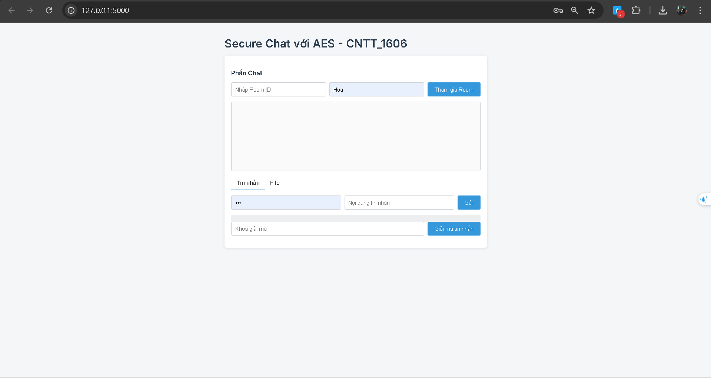

Secure Chat với AES - CNTT_1606

Giới thiệu:
Đây là một ứng dụng chat bảo mật sử dụng thuật toán mã hóa AES để bảo vệ thông tin truyền tải. Ứng dụng này được xây dựng bằng HTML, CSS, JavaScript và sử dụng Socket.IO để thực hiện giao tiếp thời gian thực giữa các client.

Tính năng:
- Gửi và nhận tin nhắn bảo mật giữa các client
- Gửi và nhận file bảo mật giữa các client
- Mã hóa và giải mã tin nhắn và file sử dụng thuật toán AES
- Hỗ trợ đa dạng định dạng file (txt, png, jpg, jpeg)

Cài đặt:
1. Cài đặt Node.js và Socket.IO trên máy chủ
2. Tải xuống và giải nén mã nguồn ứng dụng
3. Chạy ứng dụng bằng cách mở file index.html trong trình duyệt

Sử dụng:
1. Nhập Room ID và tên người dùng để tham gia vào một phòng chat
2. Gửi tin nhắn và file cho các thành viên khác trong phòng chat
3. Nhận và giải mã tin nhắn và file từ các thành viên khác

Mã nguồn:
Mã nguồn ứng dụng được viết bằng HTML, CSS, JavaScript và sử dụng Socket.IO. Mã nguồn bao gồm các file sau:
- index.html: File chính của ứng dụng
- socket.io.js: File thư viện Socket.IO

Lưu ý:
- Ứng dụng này chỉ hỗ trợ mã hóa và giải mã tin nhắn và file sử dụng thuật toán AES
- Ứng dụng này không hỗ trợ lưu trữ tin nhắn và file trên máy chủ
- Ứng dụng này chỉ hỗ trợ giao tiếp thời gian thực giữa các client thông qua Socket.IO

Tác giả:
[Nguyễn Trung Thành]
[nguyentrungthanhdev@gmail.com]

Giấy phép:
Ứng dụng này được phát hành dưới giấy phép MIT
Bạn có thể sử dụng, sửa đổi và phân phối ứng dụng này miễn phí
